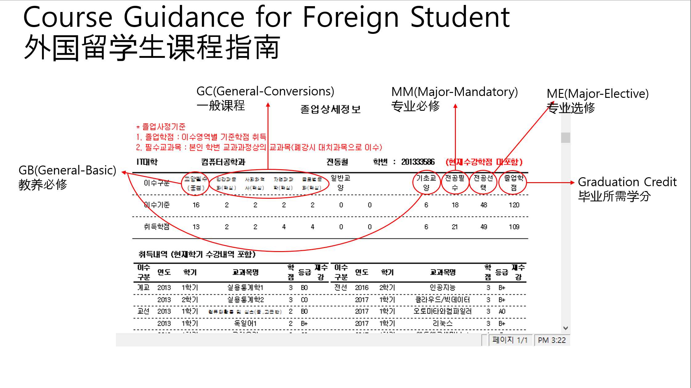

## 一般内容

这是十分重要的内容。

#### 1)奖学金

* 每学期您必须至少选择12个学分的课程（如果是第4学年，则必须选择9个学分的课程）。
* 如果一个学期无法获得12个学分，就无法获得留学生奖学金（金额为学费的40%）。

#### 2) 毕业学分要求 120分

* 专业分 66分 (专业必修 30分 专业选修 36分)
* 教养分 30分 (基础教养 18分 融合教养 6分 阶段教养 6分)
* 额外课程 24分

#### 3) 课程设置/注册规则

* 计算机工学系开设专业必修，专业选修，阶段教养科目。
* 文理学院和OIA提供基础教养，融合教养科目。
* 每个学期提供所有专业必修课程。
* 每学期提供部分专业选修课程。
* 所有以英语授课的课程均标记有“（외국인전용）원어강의”。
* 您也可以选择“원어강의”科目，但它们是针对韩国学生的英语授课课程。
* 您可以选择未标记为英语授课的专业选修课程，授课将以韩文进行。
* 除基础教养和融合教养外，有时为普通科目提供不同的标题作为课程，但是您只要选择任何以英语   提供的科目，就会获得学分。

#### 4) 学期时间表
| 学期            | 时间                  | 
|:--------------- |:---------------------|
| 第一学期(春季)   |三月上旬-六月(16周)    | 
| 暑假            |  六月下旬-八月        | 
| 第二学期(秋季)   | 九月上旬-十二月(16周) | 
| 寒假            | 十二月下旬-2月        | 

#### 5) 主要接待室

-  国际事务办公室：全球中心613室。
    -   签证，入学，奖学金，学期注册，支付学费，一般咨询，校园生活。

#### 6) 系主任办公室

- 系主任：黄熙政教授，IT大楼6-1室。
  - 课程，课程注册，学术咨询，部门生活。
  - 办公时间：星期一17:00〜17:30，星期二16:00〜17:00

#### 7) 学生服务中心

- 学生服务中心：视觉塔B室101室（入口-帕斯奇咖啡厅后面）
  - 学期休假/返校，系转学，双/次专业。

## 检查获得的学分

如果您想知道自己的课程状态，但不知道如何检查它，请参阅“如何进入课程状态.gif”。它将指导您如何进入课程状态页面。

“外国留学生课程手册.jpg”是关于课程状态页面的指导。请查看图片，并了解您的课程状态。

#### 如何进入课程状态

## 申请笔记本电脑支援金
## 转系申请
## 课程设置
## 可申请学分数
## 课程申请
## 外国人班授课目录
## 学费通知书查询与打印
## 学费缴纳
