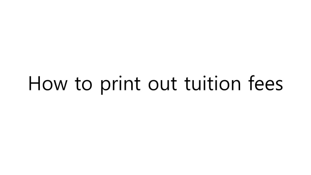
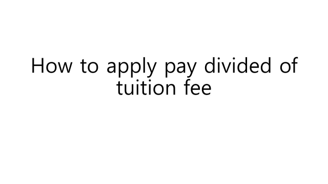

## 一般内容

> 这是十分重要的内容。

#### 1)奖学金

* 每学期您必须至少选择12个学分的课程（如果是第4学年，则必须选择9个学分的课程）。
* 如果一个学期无法获得12个学分，就无法获得留学生奖学金（金额为学费的40%）。

#### 2) 毕业学分要求 120分

* 专业分 66分 (专业必修 30分 专业选修 36分)
* 教养分 30分 (基础教养 18分 融合教养 6分 阶段教养 6分)
* 额外课程 24分

#### 3) 课程设置/注册规则

* 计算机工学系开设专业必修，专业选修，阶段教养科目。
* 文理学院和OIA提供基础教养，融合教养科目。
* 每个学期提供所有专业必修课程。
* 每学期提供部分专业选修课程。
* 所有以英语授课的课程均标记有“（외국인전용）원어강의”。
* 您也可以选择“원어강의”科目，但它们是针对韩国学生的英语授课课程。
* 您可以选择未标记为英语授课的专业选修课程，授课将以韩文进行。
* 除基础教养和融合教养外，有时为普通科目提供不同的标题作为课程，但是您只要选择任何以英语   提供的科目，就会获得学分。

#### 4) 学期时间表
|学期|时间| 
|---|---|
| 第一学期(春季)|三月上旬-六月(16周)| 
| 暑假|六月下旬-八月| 
| 第二学期(秋季)|九月上旬-十二月(16周)| 
| 寒假|十二月下旬-2月| 

#### 5) 主要接待室

-  国际事务办公室：全球中心613室。
    -   签证，入学，奖学金，学期注册，支付学费，一般咨询，校园生活。

#### 6) 系主任办公室

- 系主任：黄熙政教授，IT大楼6-1室。
  - 课程，课程注册，学术咨询，部门生活。
  - 办公时间：星期一17:00〜17:30，星期二16:00〜17:00

#### 7) 学生服务中心

- 学生服务中心：视觉塔B室101室（入口-帕斯奇咖啡厅后面）
  - 学期休假/返校，系转学，双/次专业。

## 检查获得的学分

> 如果您想知道自己的课程状态，但不知道如何检查它，请参阅“如何进入课程状态.gif”。它将指导您如何进入课程状态页面。

> “外国留学生课程手册”是关于课程状态页面的指导。请查看图片，并了解您的课程状态。

#### 如何进入课程状态

## 申请笔记本电脑支援金
## 转系申请
> 请查看学校网站

> http://www.gachon.ac.kr/community/opencampus/06.jsp?mode=view&boardType_seq=340&board_no=526

1.申请期间：2018.11.12（星期一）〜11.23（星期五）。

2.申请资格：第一学年第二学期开始。

3.招收人数：每个学科入学招收人数的50%。

4.成绩要求：平均成绩2.5分以上

5.提交文件：申请，等级证明，学习计划。
* 旅游管理，东洋文学，建筑工程，室内环境，生物纳米，生物医药，运动康复福利不需要学习计划。
- 如果申请学科需要请提交其他材料，请一并提交。    

6.接待处：现在所在学科办公室

7.公告：2019.01.17(Thur) University website

8.注意：
  * 如果您的申请通过，则在您之前的专业获得的学分将根据您新专业的课程进行更改。课程将对应于您所在学号的学年。
  * 基础教养，阶段教养将以相同的学分转移。
  * GM，ME，MM将更改为常规选择。
  * 专业变更的第一学期不能获得优秀奖学金。
  * 如果您的申请通过，您必修在新专业学习一些课程。
  * 专业变更后，需要支付以变更的学费。

有关更多信息，请联系您当前的专业办公室。
## 课程
> 课程搜索-点击链接

> http://203.249.126.126:9090/servlets/jsp/timetable/frame.jsp?lang=en

2017.2018学年
  * 带有ENG标记的科目是英语授课的科目。
  * 实际开设的科目每学期可能有所不同。
  * 选择适合您年级的课程。

[Curriculum-CE-2017](pdf/Curriculum-CE-2017.pdf)

[Curriculum-CE-2018](pdf/Curriculum-CE-2018.pdf)
## 可申请学分数
## 课程申请
## 外国人班授课目录
## 学费通知书查询与打印
>如果您想查看或打印学费，但不知道该怎么做，请下载“如何打印学费账单.pptx”并阅读。

 
[How to printout tuituion payment bill.pptx](pdf/How_to_print_out_tuition_fees.pptx){: target="_blank"}

- 不同学生之间的学费是不同的。
- 如果您对查询有疑问或问题，请到办公室询问。

## 学费缴纳
>如果您不知道如何查询并打印您的学费付款单，请检查此部分上方的“如何打印学费付款单.pptx”。
>在学费缴纳期间，您只能在07:00至23:30之间支付学费。

学费通知书

**一次性支付**
- 第一次缴费时间 : 2019. 08. 26(周一) ~ 08.30(周五)
- 第二次缴费时间 : 2019.09.09(周一) ~ 09.13(周五)
- 第三次缴费时间 : 2019.09.23(周一) ~ 09.27(周五)
    - 在 2019.08.13(周三) 13:00之后查询并打印您的学费通知书。

**分期付款**
- 申请时间 : 2019.08.01(周五) ~ 08.30(周五) 15:00
- 通过公示日期 : 2019.08.30(周五) 16:00
- 第一部分(学费的三分之一) : 2019.09.09(周一) ~ 09.20(周五)
- 第二部分(学费的三分之一) : 2019.10.07(周一) ~ 10.18(周五)
- 第三部分(学费的三分之一) : 2019.11.04(周一) ~ 11.16(周五)
    - 您可以在付款的第一天打印出每笔学费。
    - 请检查“如何申请支付学费.pptx的部分'

 
[How to apply to divided of tuition fee.pptx](pdf/how_to_divide_tuition_fee.pptx){: target="_blank"}
