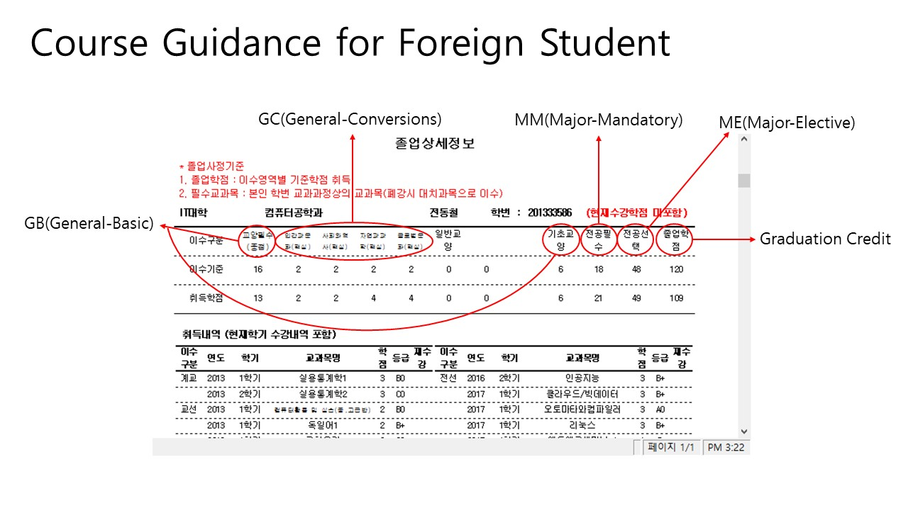

## General Resources
> They are you must know basically.

> GB: General-Basic, GC: General-Conversions, GM: General-Major, MM: Major-Mandatory, ME: Major-Elective

#### 1) Scholarship
- You must register at least **12 credits** (9 credits in case of the senior year) every semester.
- If you can't acquire 12 credits during one semester, you couldn't receive international scholarship(40% discount of tuition fee).

#### 2) Credit Requirements for Graduation: 120
- Major: 66(MM:30, ME:36)
- General Education 30(GB:18, GM:6, GC:6)
- Extra units: 24

#### 3) Course Offer / Registration Rules
- The department offers MM, ME, GM subjects.
- Liberal arts college and OIA offer GB, GC subjects.
- All **MM** courses are offered every semester.
- Selected **ME** courses are offered every semester.
- Every major courses which are offered in english are marked as "(외국인전용)원어강의".
- You may also register "원어강의" subjects but they are english lecture classes for korean students.
- If you want to enroll any other **ME** subjects which are not open in english lecture you may register but lectures are conducted in korean.
- Except **GB** and **GM**, sometimes general subjects are offered different title as curriculum but you just take any subjects offered in english and that credits will be accepted later.

#### 4) Academic Calendar in General

|Semester|Schedule|
|---|---|
|1st semester (Spring)|Early March ~ Mid. June (16 weeks)|
|Summer Vacation|	Late June ~ August|
|2nd semester (Fall)|Early September ~ Mid. December (16 weeks)|
|Winter Vacation|Late December ~ February|
 

#### 5) Student Support
**Main contact point**
- The office of international affairs: Room #613, Global center.
    - VISA, Admission, Scholarship, Semester registration, Paying tuition fees, General counseling, Campus life.

**Department Contact Point**
- Department chair: Prof. Hwang Hee Joung, Room #6-1, IT Building.
    - Curriculum, Course enrollment, Academic counseling, Dept. life.
    - Office hour: Monday 17:00 ~ 17:30, Thuesday 16:00 ~ 17:00

**Student Service**
- Student service center: Room #101, Vision tower B (Entrance - behind the cafe pascucci)
    - Semester off / return, Dept. transfer, Double/Minor major.

## Acquired Credit 
> If you want to know your course status but don't know how to check it, see "How to go Course Status.gif". It will guide you how to go to your course status page.

> "Course Mannual for Foreign Student.jpg" is guidance about course status page. Please see the image, and be aware of your course status.

 

 

## Apply for Laptop Support Fund
## Apply for Department Transfer

>Please check the university website.
><http://www.gachon.ac.kr/community/opencampus/06.jsp?mode=view&boardType_seq=340&board_no=526>

1. Application Period : 2018.11.12(Mon) ~ 11.23(Fri)

2. Eligibility grade : 1st year, 2nd Semester (excluding a student on leave of absense) or after grade.

3. Recruitment Number : 50% of the entrance quota for each department

4. Requirement : Above 2.5 unit of a year's average rating limited to passer (Includ 2018-2 semester)

5. Documents to Submit : Application, Provement of grade, Study plan
    * Tourism Management, Oriental Language, Architectural Engineering, Civil Environment, Bionano, Biomedical, Exercise Rehabilitation Welfare don't need the study plan.
    * Other document should be submitted if the department require.

6. Reception place : Current Dept. Office

7. Announcement : 2019.01.17(Thur) University website

8. Cautions : Important notice.
    (1) If you are permitted, the credits acquired in your previous dept. are changed according to the curriculum of your new dept. corresponding to the student's number.

    (2) GB, GC will be accepted with the same credit.

    (3) GM, ME, MM will be changed to General Selection.

    (4) After changing dept., you must pay tuition fees that have changed.

    (5) You can't take the academic excellence scholarship in the first semester you change.
    
	(6) If you are permitted, you must take some course in your new department.

For more information please contact your current dept. office.

## Curriculum
>Course Search - Click following link
><http://203.249.126.126:9090/servlets/jsp/timetable/frame.jsp?lang=en>

Curriculum(2017,2018)
- The subjects which marked in ENG field are candidate subjects for english lecture class.
- Actual offered subjects may be different every semester.
- Take courses for your grade.

    [Curriculum-CE-2017](pdf/Curriculum-CE-2017.pdf)/[Curriculum-CE-2018](pdf/Curriculum-CE-2018.pdf)

## Credit
## Register for Class
## Class List for Foreign Students
## Tuition Payment Bill Printout
## Tuition Fee Payment
